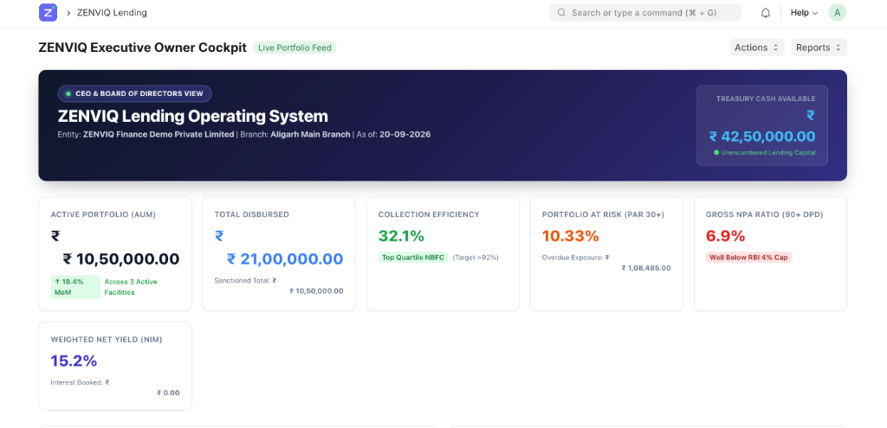
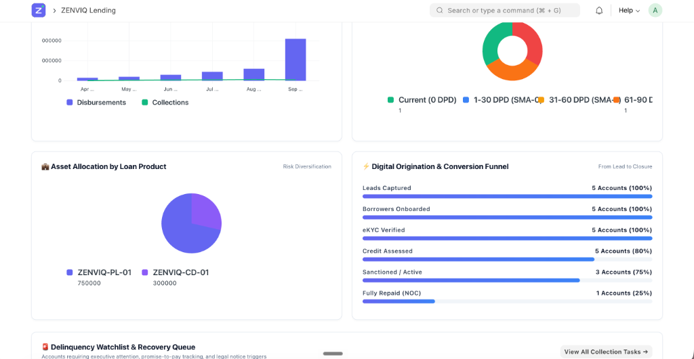
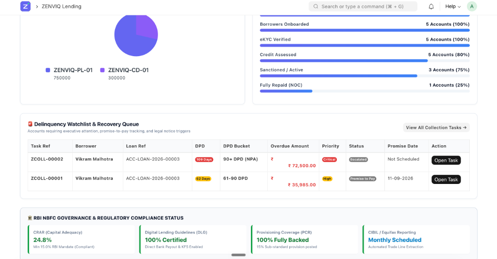
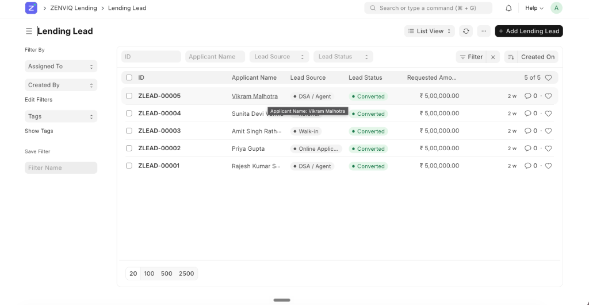
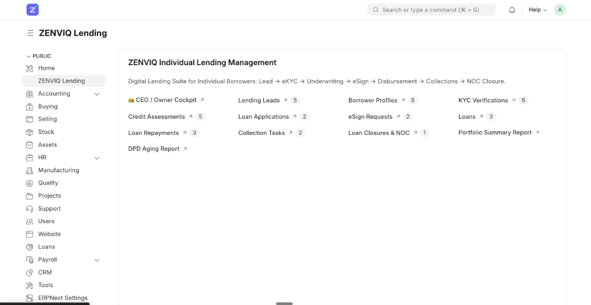

# 🏆 ZENVIQ Individual Lending System

ZENVIQ is a comprehensive, open-source Loan Management System (LMS) and Loan Origination System (LOS) built on the robust Frappe Framework. Designed specifically for NBFCs and Fintechs, it provides an end-to-end digital lending operating system.

## 📸 Platform Screenshots

### 1. CEO / Executive Cockpit
Real-time insights into AUM, Collection Efficiency, and Portfolio at Risk (PAR).


### 2. Analytics & Origination Funnel
Visual breakdown of asset allocation and digital conversion metrics from Lead to Closure.


### 3. Delinquency Watchlist & RBI Compliance
Automated tracking of NPA buckets (SMA-0, SMA-1, SMA-2) and RBI regulatory compliance status.


### 4. Lending Leads Management
Organized pipeline tracking for all inbound borrower applications.


### 5. ZENVIQ Lending Suite Overview
The complete suite of modules including eKYC, Underwriting, eSign, Disbursement, and Collections.


---

## 🚀 Key Features
*   **Instant Onboarding**: RBI-compliant eKYC, PAN validation, and CIBIL integration.
*   **Automated Underwriting**: Dynamic FOIR and DTI calculation engine.
*   **Digital Signatures**: Aadhaar eSign and eNACH mandate registration.
*   **Double-Entry Accounting**: Real-time General Ledger updates upon disbursement and EMI collection.
*   **NPA & DPD Management**: Automated tracking of SMA-0, SMA-1, SMA-2, and NPA buckets with formal reporting.
*   **CEO Cockpit**: Real-time insights into AUM, Collection Efficiency, and PAR 30.

## 🛠 Tech Stack
*   **Backend**: Python, MariaDB, Redis, Frappe Framework
*   **Frontend**: Frappe UI, HTML5, CSS3, JavaScript

## 📦 Installation
Requires a standard Frappe/ERPNext bench environment.
```bash
bench get-app https://github.com/PrateekSingh45/zenviq-erp-lending.git
bench --site yoursite.local install-app zenviq_lending
```

## 📄 License
MIT License
